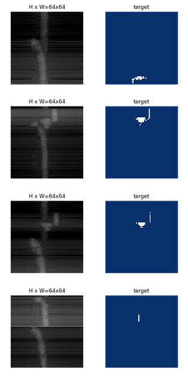

# (Attempt) Mask R-CNN Implementation for Active Sonar Object Detection and Segmentation

**_Note - This implementation currently does not work (pivoted to U-Net based)_**

## Installation

Refer to [Mask R-CNN](https://github.com/matterport/Mask_RCNN) package page

## Data

Refer to `SonarNet/Architectures/UNet/README.md`
   
## Overview

Briefly, Mask R-CNN extends previous work that generates proposals to localize and segment objects using a Feature Pyramid Network (FPN) and a Residual Network backbone to generate bounding boxes, segmentation masks, and prediction values for each instance of an object in the image.

Mask R-CNN claims to check off the boxes of detection, classification, segmentation, and confidence score.

The creators of Mask R-CNN has an open source package you can use in libraries such as Keras, which is a high-level neural networks API, written in Python, that is capable of running on top of various deep learning libraries Tensorflow, CNTK, or Theano to enable fast implementations.

So we studied some example code they had about how to train the Mask R-CNN model on your own dataset, preprocessed our data to fit the mouth of the model, and the model trained.