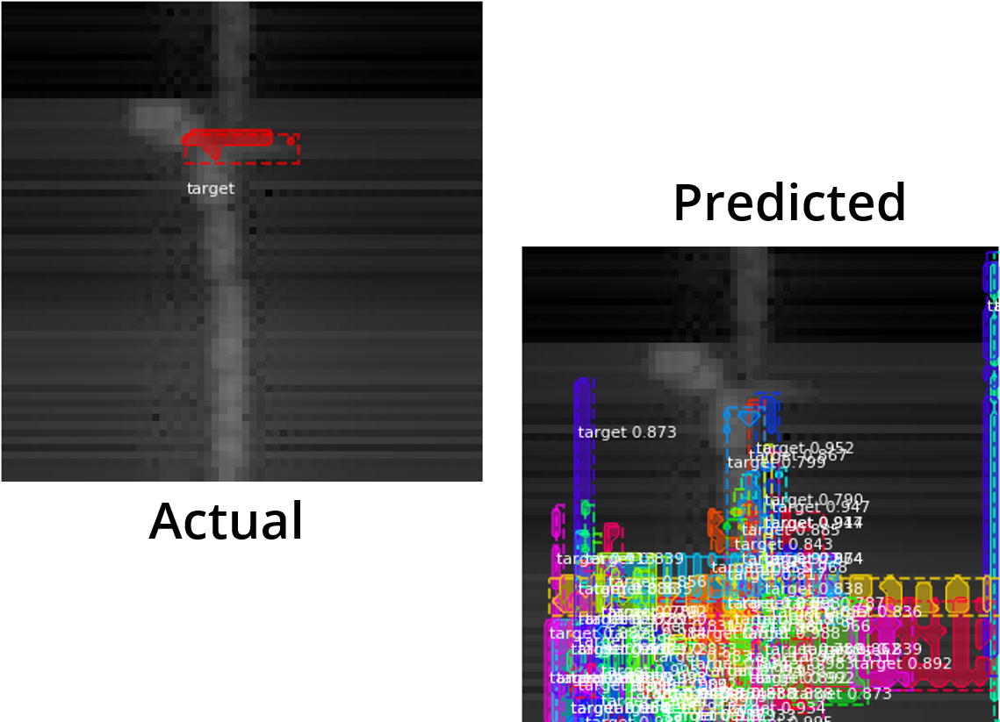

# (Attempt) Mask R-CNN Implementation for Active Sonar Object Detection and Segmentation

**_Note - This implementation currently does not work (pivoted to U-Net based)_**

## Installation

Refer to [Mask R-CNN](https://github.com/matterport/Mask_RCNN) package page

## Data

Refer to `SonarNet/Architectures/UNet/README.md`
   
## Overview

Briefly, Mask R-CNN extends previous work that generates proposals to localize and segment objects using a Feature Pyramid Network (FPN) and a Residual Network backbone to generate bounding boxes, segmentation masks, and prediction values for each instance of an object in the image.

Mask R-CNN claims to check off the boxes of detection, classification, segmentation, and confidence score.

The creators of Mask R-CNN has an open source package you can use in libraries such as Keras, which is a high-level neural networks API, written in Python, that is capable of running on top of various deep learning libraries Tensorflow, CNTK, or Theano to enable fast implementations.

So we studied some example code they had about how to train the Mask R-CNN model on your own dataset, preprocessed our data to fit the mouth of the model, and the model trained. Above, the left column is a sample of a slice of what the image looks like with its associated mask to classify it as a target on the right column.

After training, I fed the model a few testing images to see how well it did to detect, classify, and segment targets from the image. 
As you can see with the figure above is a slice of the actual image overlaid with its mask on the left and the predictions on the right. Clearly, our model failed miserably at its learning task.

After some tweaking of the configuration of the Mask R-CNN implementation we couldn't get a fraction of the results I was expecting due to the lack of understanding of the complexity of this model with all of its moving parts.
