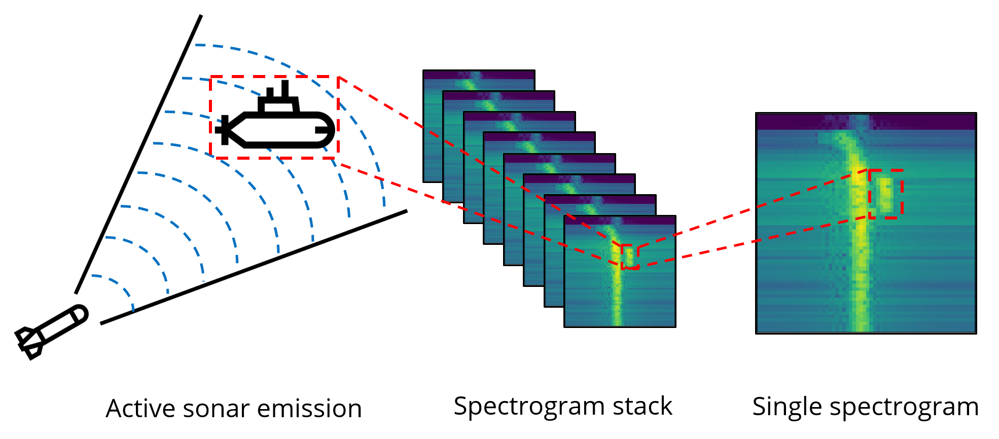
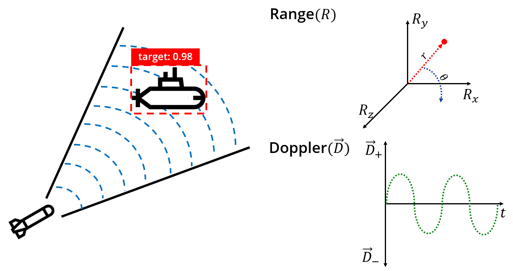
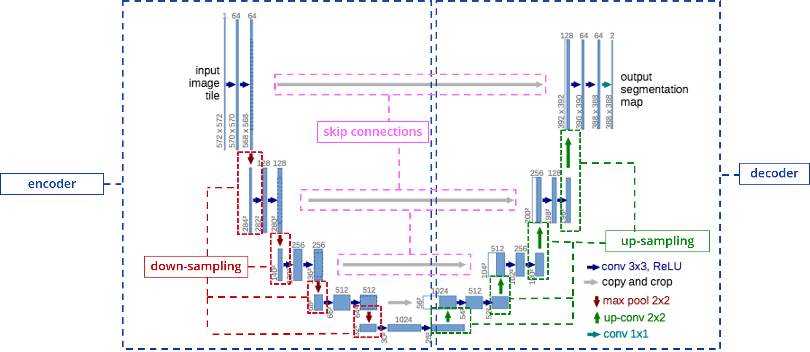
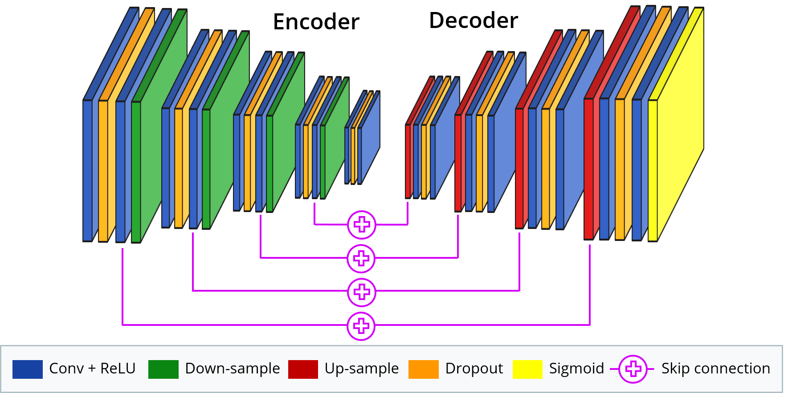
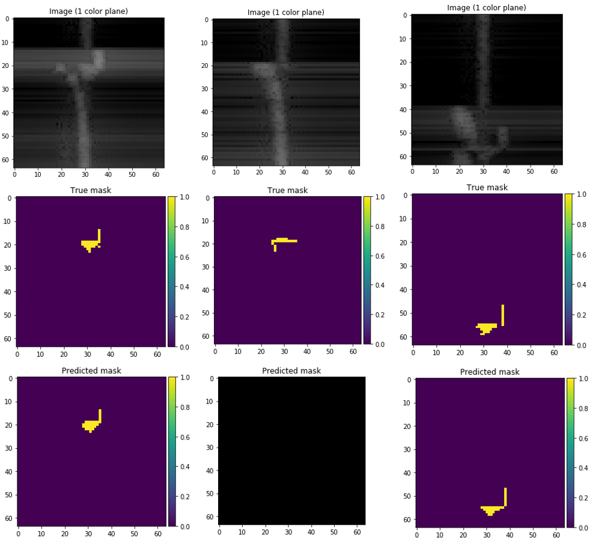
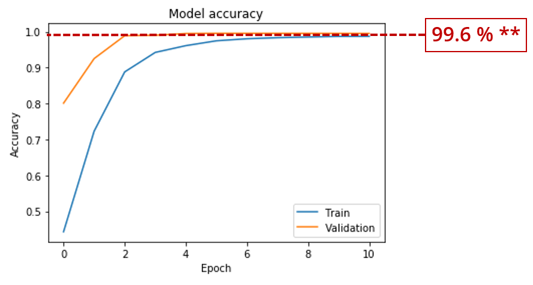
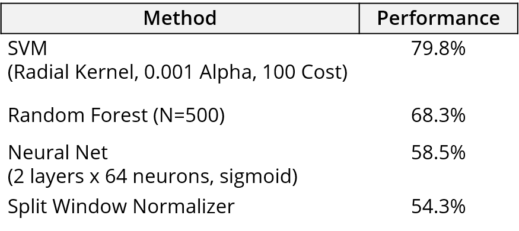

# Application of Image Segmentation Neural Networks to Sonar Detection and Classification

Active sonar emits acoustic signals or pulse of sound into the water to detect objects. If an object is in the path of the sound pulse, the sound bounces off the object and returns an "echo" to the sonar transducer that is able to receive signals.

This signal is propagated in various angles and each of these angles are represented in a spectrogram stack. Each single spectrogram frame will show if the object is detected from the echo. By determining time between the emission of the sound pulse and its reception, the transducer can determine the range and orientation of the object.

Our main objective is to use underwater sensor data to detect and classify targets that will return the range, angles, and Doppler of a target. We would also want to quantify the confidence of this detection and classification via a confidence score of some sort.

Since pixel-wise image segmentation is a well-studied problem in the computer vision literature and it can be easily modified to handle detection and classification, we thought we would start there.

We based our model on the U-Net architecture that yields precise segmentation of neuronal structures in electron microscopic stacks with very few training images.

The main ideas behind U-Net's architecture consists of an encoder and decoder structure with skip connections.

***Q: What is an encoder and decoder structure?***

In general, convolutional layers coupled with down sampling layers produce a low-resolution tensor containing the high-level information about the image. Taking this low-resolution spatial tensor, we need to produce high-resolution segmentation outputs. To do this, we need mirrored convolutional layers that utilize up sampling instead of down sampling to get back the low-level information. This is known as an encoder-decoder structure.

***Q: What are skip connections?***

Skip connections gives the decoder access to the low-level features produced by the encoder layers.

## How To

## Overview

### Data
- [ ] Intro
- [ ] how to generate data
- [ ] how to run script to create Dictionary.txt
- [ ] where to set global paths for data

### Data Pre-processing

The sonar images (i.e. `ImageMap-{id}.dat`) and true masks (i.e. `LabelMap-{id}.dat`) for the training and testing data are stored as numpy arrays.

The shape of the images and true masks are `64x64x25` and `64x64x1` respectively.

### Model

The current model is based on the U-Net architecture with some additional features.

We kept the basic encoder and decoder structure with skip connections but added dropout layers in-between the convolutional layers which set a fraction of the input units to 0 to prevent overfitting.

Each convolutional layer has a stride of `(3,3)` with `same` padding and `relu` activation.

Once an image is passed through model, we use a Sigmoid activation function layer to predict the probability of our output.

Down-sampling is represented in the `MaxPooling2D` layers in the encoder and up-sampling in the `Conv2DTranspose` layers in the decoder, each with a stride of `(2,2)`.

An [Adam Optimizer](https://arxiv.org/pdf/1412.6980.pdf) and [Binary Cross-Entropy Loss](https://towardsdatascience.com/understanding-binary-cross-entropy-log-loss-a-visual-explanation-a3ac6025181a) is used to configure the model for training along with the standard accuracy metric.

### Training

`EarlyStopping` is used to stop training the model when the loss stops improving over 5 epochs with no improvement. Additionally, `ModelCheckpoint` will save the best model after every epoch as `SonarNet-UNet.h5`.

We fit the model on 5000 sampled training data, using a validation split of 25%. We used a relatively small batch size of 8 because of the small amount of data used over 30 epochs.

### Results

Here are some example detections on some random training samples.

As you can see, the predictions on the left and right returned a fairly accurate segmentation of the target where as the middle segmentation did not segment the target at all.

The current architecture started to average 99.6% accuracy and a 6.3% loss score over 10 epochs of correctly segmenting a target.

We evaluated the model on 500 separate testing data and got scores of 99.58% accuracy and 6.69% loss. This tends to be good sign when your training and testing accuracy are high and roughly the same but overfitting could also be at play.

Matt Daily's prior investigation in various types of machine learning technologies to detect simple echoes with presence of reverberation and background noise has shown dominate results using SVMs with accuracy of 79.8%. Although our U-Net CNN implementation currently obtains around 99.6% accuracy, it comes with a few caveats that I will go into a bit towards the end of the challenges section.

### Challenges

### Future Outlook

## Acknowledgements

## References