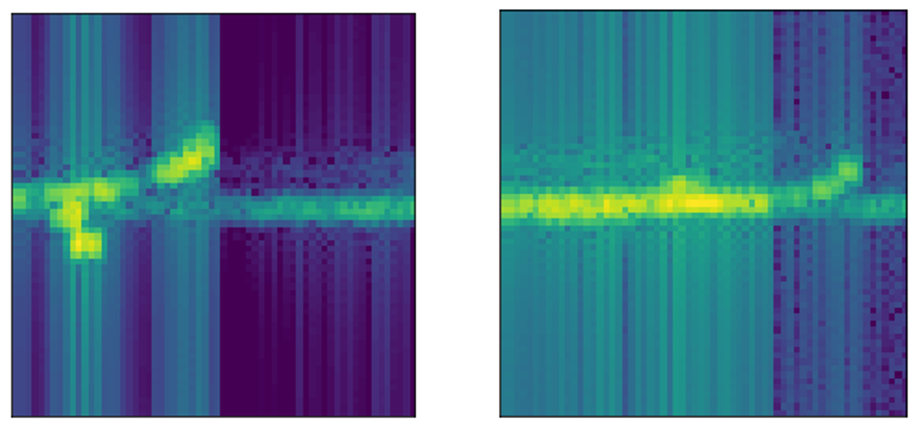
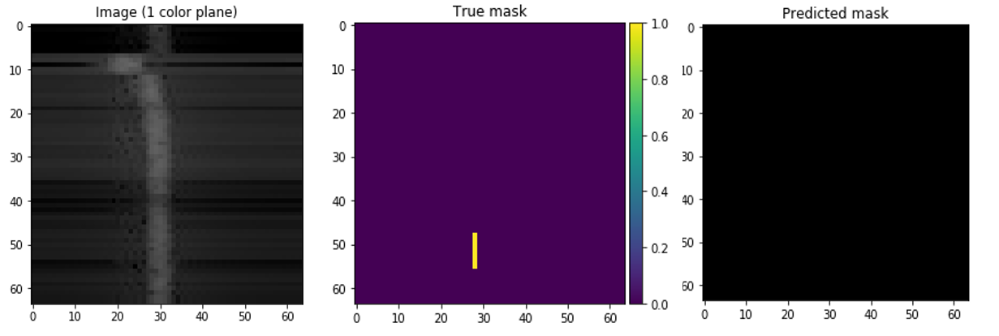
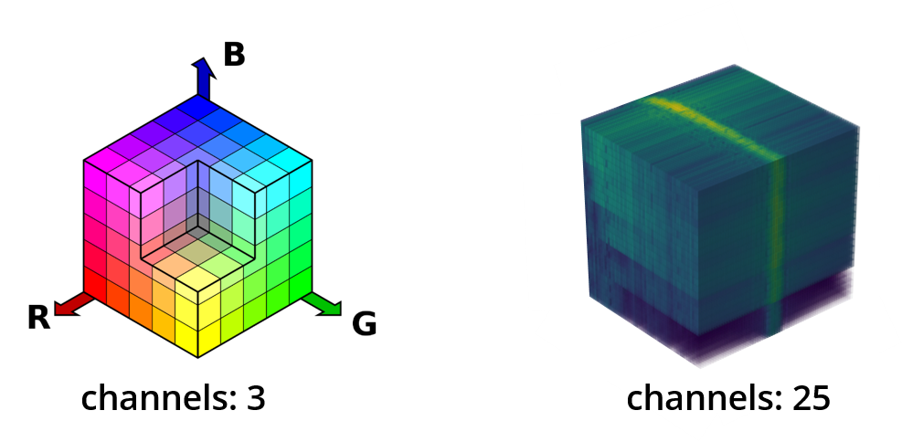
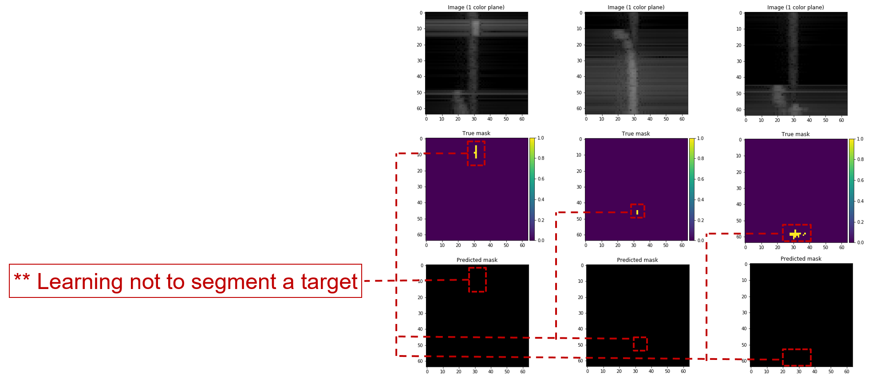

# Application of Image Segmentation Neural Networks to Sonar Detection and Classification

## Requirements

MATLAB License to run the active sonar based data simulator.

Python 3.7, Tensorflow 1.14, Keras 2.2 and other common packages are listed in `requirements.txt`.

## Installation

1. Clone this repository
2. Create virtual environment using `conda` (or `pip`) using a name of your choice (i.e. `unet_env`) and version of python
   ```
   conda create -n unet_env python=3.7
   ```
3. Activate this environment
4. To install dependencies via `conda` and to avoid all dependencies failing to install if one package fails (found [here](https://gist.github.com/luiscape/19d2d73a8c7b59411a2fb73a697f5ed4))
    ```
    while read requirement; do conda install --yes $requirement; done < requirements.txt 
    ```

5. To be able to select the `conda` environment you just created in a `jupyter notebook`, run the following command
   ```
   python -m ipykernel install --user --name unet_env --display-name "Python (unet_env)"
   ```
6. Startup the project
   ```
   jupyter notebook U-Net-SonarNet.ipynb
   ```

    **_Update: There was a tensorflow bug that led to the following error_**

   ```
   AbortedError: Operation received an exception:Status: 5, message: could not create a view primitive descriptor, in file tensorflow/core/kernels/mkl_slice_op.cc:433
        [[{{node training/Adam/gradients/concatenate_4/concat_grad/Slice_1}}]]
   ```
   
   **_If you get this error, to fix it, run the following command to update tensorflow to the eigen package so the error doesn't appear (bug report found [here](https://github.com/tensorflow/tensorflow/issues/17494#issuecomment-511231733))._**

   ```
   conda install tensorflow=1.14.0=mkl_py37h45c423b_0
   ```

## Data

The acoustic model simulator generates samples of sonar images with a target embedding in each images.

The simulator produces the following for each image `id`:

- `ImageMap-<id>.dat`: 25 image planes with each being `64x64` image w/ values 0-255; thus, each image is of size `25x64x64`

- `LabelMap-<id>.dat`: a single `64x64` image that is 1 or 0 for target or no target respectively across all planes
    
- `Detections-<id>.dat`: detection statistics
  
- `FeatureMap-<id>.dat`: file where the target is relative to the sonar

For the purposes of our model, we only utilize `ImageMap-<id>.dat` and `LabelMap-<id>.dat`.

To generate sonar data:

1. Make a directory to where you want your training data stored (e.g. `mkdir SonarNet/GeneratedData/train`)
2. Open `SonarNet/AcousticModel` in MATLAB
3. Run the following command to generate training data where the first argument is the relative path to your training directory and the second is number of samples
   ```
   makeTrainingData('../GeneratedData/train/', 1000)
   ```
4. Next, we need generate a `Directory.txt` file to list the image ids. To do this, configure the second line in the script `makeDirectory.zsh` to point to the path of your training data (e.g. `cd ../GeneratedData/train`) and run the script while in `SonarNet/AcousticModel` within your given shell (i.e. `zsh`)
   ```
   zsh makeDirectory.zsh
   ```

_Note - You'll need to set the global paths for your data in `U-Net-SonarNet.ipynb`_

## Overview

### Introduction


Active sonar emits acoustic signals or pulse of sound into the water to detect objects. If an object is in the path of the sound pulse, the sound bounces off the object and returns an "echo" to the sonar transducer that is able to receive signals.

This signal is propagated in various angles and each of these angles are represented in a spectrogram stack. Each single spectrogram frame will show if the object is detected from the echo. By determining time between the emission of the sound pulse and its reception, the transducer can determine the range and orientation of the object.

### Project


Our main objective is to use underwater sensor data to detect and classify targets that will return the range, angles, and Doppler of a target. We would also want to quantify the confidence of this detection and classification via a confidence score of some sort.


Since [pixel-wise image segmentation](https://divamgupta.com/image-segmentation/2019/06/06/deep-learning-semantic-segmentation-keras.html) is a well-studied problem in the computer vision literature and it can be easily modified to handle detection and classification, we thought we would start there.

We based our model on [U-Net: Convolutional Networks for Biomedical Image Segmentation](https://arxiv.org/pdf/1505.04597.pdf) that yields precise segmentation of neuronal structures in electron microscopic stacks with very few training images.


The main ideas behind U-Net's architecture consists of an encoder and decoder structure with skip connections.

**_Q: What is an encoder and decoder structure?_**

In general, convolutional layers coupled with down sampling layers produce a low-resolution tensor containing the high-level information about the image. Taking this low-resolution spatial tensor, we need to produce high-resolution segmentation outputs. To do this, we need mirrored convolutional layers that utilize up sampling instead of down sampling to get back the low-level information. This is known as an encoder-decoder structure.

**_Q: What are skip connections?_**

Skip connections give the decoder access to the low-level features produced by the encoder layers.

#### Data Pre-processing

The sonar images (i.e. `ImageMap-<id>.dat`) and true masks (i.e. `LabelMap-<id>.dat`) for the training and testing data are stored as numpy arrays.

Post pre-processing, the shape of the images and true masks are `64x64x25` and `64x64x1` respectively.

#### Model

The current model is based on the U-Net architecture with some additional features.


We kept the basic encoder and decoder structure with skip connections but added dropout layers in-between the convolutional layers which set a fraction of the input units to 0 to prevent overfitting.

Each convolutional layer has a stride of `(3,3)` with `same` padding and `relu` activation.

Once an image is passed through model, we use a Sigmoid activation function layer to predict the probability of our output.

Down-sampling is represented in the `MaxPooling2D` layers in the encoder and up-sampling in the `Conv2DTranspose` layers in the decoder, each with a stride of `(2,2)`.

An [Adam Optimizer](https://arxiv.org/pdf/1412.6980.pdf) and [Binary Cross-Entropy Loss](https://towardsdatascience.com/understanding-binary-cross-entropy-log-loss-a-visual-explanation-a3ac6025181a) is used to configure the model for training along with the standard accuracy metric.

#### Training

`EarlyStopping` is used to stop training the model when the loss stops improving over 5 epochs with no improvement. Additionally, `ModelCheckpoint` will save the best model after every epoch as `SonarNet-UNet.h5`.

We fit the model on 5000 sampled training data, using a validation split of 25%. We used a relatively small batch size of 8 because of the small amount of data used over 30 epochs.

#### Results

Here are some example detections on some random training samples.


As you can see, the predictions on the left and right returned a fairly accurate segmentation of the target where as the middle segmentation did not segment the target at all.


The current architecture started to average 99.6% accuracy and a 6.3% loss score over 10 epochs of correctly segmenting a target.

We evaluated the model on 500 separate testing data and got scores of 99.58% accuracy and 6.69% loss. This tends to be good sign when your training and testing accuracy are high and roughly the same but overfitting could also be at play.


Matt Daily's prior investigation in various types of machine learning technologies to detect simple echoes with presence of reverberation and background noise has shown dominate results using SVMs with accuracy of 79.8%. Although our U-Net CNN implementation currently obtains around 99.6% accuracy, it comes with a few caveats that I will go into a bit towards the end of the challenges section.

### Challenges

For starters, the current sonar images that has been shown has been "tweaked" quite a bit. Recall that in real water, depending on the bottom compositions and roughness of the water, the reverberation from the boundaries can be much higher than the reverberation from the volume.



Above, the image to the left is a tweaked "tweaked" sonar image that you've seen that has had the volume and boundary reverb adjusted.
The image on the right is an example of a realistic sonar image representing actualy surface and bottom reverberation where the target isn’t as loud. As you can see, the sonar image has been changed drastically to “play nice” with the model. If we are to correctly build a representative model of real sonar images, we would need to be able to handle the cases of boundary reverberation.



Another issue that we've noticed from testing is that if the target is fully covered by the reverberation ridge then the model almost never segments a target in a predicted mask. This could be a hard problem to solve since the ridge produced from the sonar transmission is stochastic which cannot be learned nor removed effectively.



Current computer vision methods are tested and built under the assumption that we are working with dimensions that fall under the category of real [color models](https://en.wikipedia.org/wiki/Color_model) such as RGB and CMYK.
With sonar images, we are dealing with 25 dimensions of “color” that represent the angles of the images. It is uncertain and unclear how this representation is affecting the model and the learning process it undergoes.

Recall that our model was getting 99.6 % accuracy over 5000 training samples. We were skeptical that the model was doing so well and hypothesized that it was learning to not segment the target to minimize loss due to the small size of the target compared to large size of the image.



Analyzing the data, this seems to be true since a solid portion of the predictive masks did not segment a target. This is a major issue that is drastically skewing the accuracy of the model and if this is to be fixed, there needs to be a way to effectively penalize the model for not segmenting a target where there is one.

### Closing


US active sonar for detection, classification, localization, and tracking are becoming ineffective in untested environments and conditions. The current state of the art methods are time consuming, imprecise, and limited by continuous human analysis of having to review each detection in real time.
To improve these active sonar technologies’ performance, we need to utilize Deep Learning techniques to improve robustness and predictability of the Navy's active sonar objectives.

Looking forward, the techniques and issues we've explored during my internship are only as good as the data that is fed into the model.
The simulation that creates the data is not meant to be accurate nor predictive, only representative of a pulsed, narrow-beam, narrow-band high frequency sonar and by association, any model based on this data may not be very accurate. Before a minimum viable product can be produced, the work we've done along with acquiring accurate sonar data needs to be vetted further.

## Acknowledgements

I'd like to thank my collaborator, Matt Daily, for his machine learning efforts and subject matter expertise on Active Sonar Systems. Lastly, I’d like to give thanks Raytheon BBN Technologies for giving me the opportunity to expand the machine learning marketing efforts. 

Thank you.